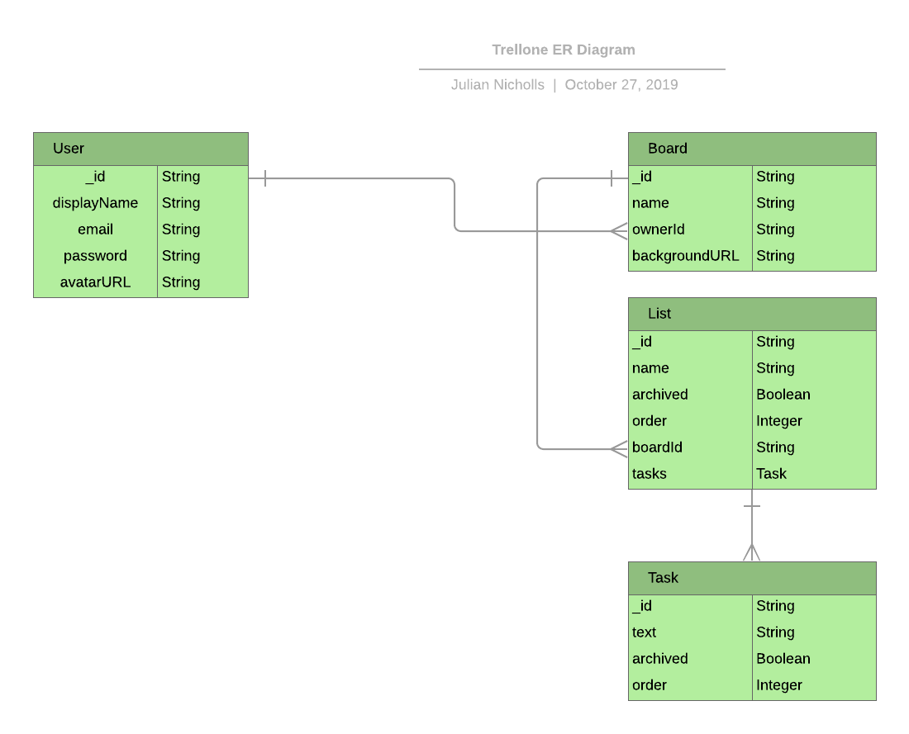

# Trellone

A Trello Clone written with the MERN stack.

On 7-Oct-2019, I restarted the front-end with the latest React, using
context and hooks. The checkboxes below show the restarted progress.

## Back End

* [x] Install Express, Volleyball, CORS and make basic server
* [x] Install Passport, Bcrypt and Mongoose for authentication
* [x] Create Mongoose models
  * [x] Create model for users
  * [x] Create model for boards
  * [x] Create model for lists
  * [x] Create model for tasks
* [x] Create Endpoints for Login and Signup
* [x] Create Endpoint for current user
* [x] Create Endpoints for Boards
  * [x] Create Endpoint for user boards
  * [x] Create Endpoint for single board
  * [x] Create Endpoint for new board
* [x] Create Endpoints for Lists
  * [x] Create Endpoint for board lists
  * [x] Create Endpoint for single list
  * [x] Create Endpoint for new list
  * [x] Create Endpoint for archive list
  * [x] Create Endpoint for update list
  * [x] Create Endpoint for new task
  * [x] Create Endpoint for archive task

## Front End

* [x] Create client with create-react-app
* [x] Remove c-r-a excesses :-)
* [x] Install Router module
* [x] Set up Router
* [x] Set up User Context
  * [x] Store returned login token in Context
  * [x] Store returned signup token in Context
  * [x] Remove token from storage on logout
* [x] Set up Boards Context
* [x] Create Header with Signup and Login buttons
  * [x] Display name and avatar when logged in
* [x] Create Login page
  * [x] Create Login form
  * [x] Wire up to UserContext
* [x] Create Signup page
  * [x] Create Signup form
  * [x] Wire up to UserContext
* [x] Create Boards page
  * [ ] Redirect to login page if not logged in
  * [x] Show user boards
  * [ ] Create new board
* [x] Create Board Lists page
  * [ ] Redirect to login page if not logged in
  * [x] Show board lists
  * [ ] Create new list
  * [ ] Archive list
  * [x] Show list tasks
  * [x] Create new task
  * [x] Edit task
  * [x] Archive task

## ER Diagram

  

## Git client

I have used Git at the command-line for more than 10 years.
Over that time, I have tried many different graphical shells for Git,
without finding one that was easier and nicer to use than the command-line
(in my view).

I have now found that [GitKraken](https://www.gitkraken.com) is an excellent
Git shell and would advise using it to everyone.

## Questions

If you have any questions about this repository, or any others of mine, please
don't hesitate to contact me.
